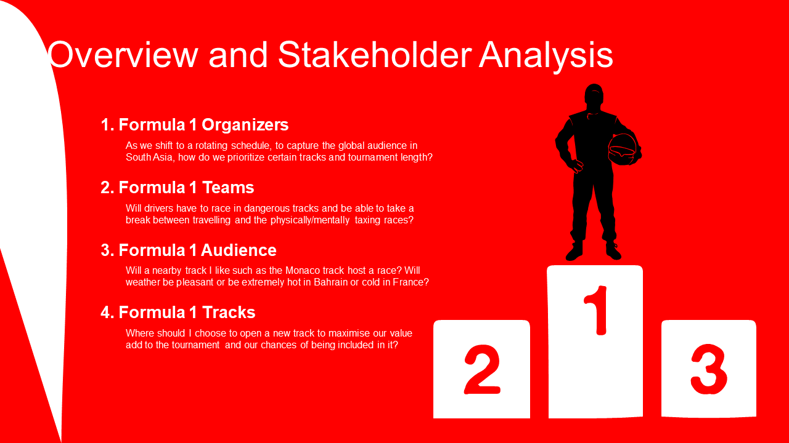

# F1 Scheduling
Rohan Verma and Arnav Aggarwal


## Running Instructions
1. Client (in the client folder)
> npm install

> npm start

2. Server (in the backend folder)
>npm install

>node app.js

## Constraints
1. Weather - The `weather.pkl` file containts daily weather for all 75 tracks. We consider perfect weather to be 25 Celsius and add a penalty of -abs(weather - 25) for each week. We convert daily weather to weekly weather by averaging the weather across that week. The weather.pkl file is generated by `formatting_data.ipynb` using the `temp.csv` file.
2. Distance - The latitude and longitude information about each track is passed through the front-end and we calculcate the distance (in miles) between two tracks using this information. For our penalty, we divide the distance by 100 (to make it comparable to other constraints) and multiply by -1 (since we're maximizing preference). We get the default values from `circuits.csv` and is formatted into `meta.json` using `formatting_data.ipynb`.
3. Audience Track Preferences - The audience track preferences range from 1-10 and is provided through through the front end. We initialise these values as random integers using `formatting_data.ipynb` and store it in `circuits.json`.
4. Team Track Preferences - Each racing team ranks all 75 tracks from 1 - 75 and we assign a score of (NUMBER_OF_TRACKS - rank) to each track. We initialise these values as a a random arrangment using `formatting_data.ipynb` and store it in `meta.json`. Similarily, we extract the teams from `team.csv` and store it in `teams.json`

Note that we're maximzing overall preference here, however, since a globally optimum solution is a time and resource intensive process, we cap the solver solve time to 50 seconds, and first maximize the audience track, then the team track preference, then the weather and then the distance. Note that each optimization builds upon the last and each runs for a maximum of 50 seconds. The individual optimization also helps account for the different magnitude of variables.

## Output
A tentative schedule with week, track, average weather during that week, distance traveled from the previous track, and an overall preference score.

## Data Sources
1. temp.csv: daily_temperature_1000_cities_1980_2020.csv from https://www.kaggle.com/datasets/hansukyang/temperature-history-of-1000-cities-1980-to-2020
2. circuits.csv: circuits.csv from https://www.kaggle.com/datasets/rohanrao/formula-1-world-championship-1950-2020
3. team.csv: https://raw.githubusercontent.com/toUpperCase78/formula1-datasets/master/Formula1_2022season_teams.csv

## File Structure
```bash
├───backend
│   ├───routes: contains the routes for the backend server
│   └───solver
|       ├───solver.py: Python script that is called by the backend solver to solve the optimization problem
|        ├───*.json files: The json files in this folder are created once the server is run; they act as data communicators from the node server to the python child process and vice versa.
|        ├───weather.pkl: File for weather data that is used by the solver
├───client
│   ├───dist: Core sources and icons
│   ├───res: Sorting icons to use for loader and the table
│   └───src
│       ├───components
|           ├───AnalysisPage.js: Main client-side page containing drag-and-drop element for team-track preferences and input boxes for latitude, longitude, and audience preferences for every track and input boxes for the start week and number of races. The page has a submit button that sends the data to the server and loads up the resulting overall solution score all with desired weeks, tracks, weather for that week and track, and distance from the previous track to the next. 
|           ├───LoadingSpinner.js: Loading Element 
|           └───spinner.css: Styling for the loading icon
│       ├───data
|           ├───circuits.json: Inital Random track preferences for each team
|           ├───meta.json: Inital Audience preferences, latitude, and longitude for each track 
|           ├───solution.json: Blank solution file to open at start 
|           └───teams.json: List of teams
│       ├───index.html: Main base HTML file 
│       └───app.js: Main app that runs AnalysisPage
│       └───fetchWithTimeout.js: Fetch to connect to backend
├───data
|   ├───circuits.csv: Contains data about the different tracks
|   ├───formatting_data.ipynb: Jupyter notebook to format all data files 
|   ├───team.csv: Contains data about the teams we display 
|   └───temp.csv: Contains daily weather data about major cities from 1980
└───presentation: class presentation and images
```
